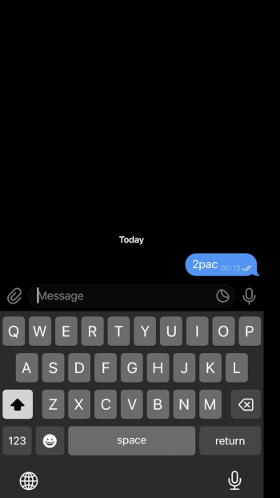

# 🎵 Telegram Music Bot

A simple Telegram bot that allows users to **search for music on YouTube and download it as MP3** directly from Telegram.  
Built with Python, `python-telegram-bot`, and `yt-dlp`.

---

## Features

- Search YouTube for songs or artists directly from Telegram.
- Browse search results with an **inline pagination keyboard**.
- Download selected songs as **MP3** with title and artist info.
- Simple and lightweight — runs locally or on cloud platforms like Railway.
- Fully open-source and easy to set up.

---

## Demo

1. Start the bot with `/start`.
2. Send a message with a song or artist name (e.g., `Coldplay Viva La Vida`).
3. Select the song you want from the results.
4. The bot will download it and send the MP3 directly to you.

---

## Installation

1. Clone the repository:

```bash
git clone https://github.com/askoti/telegram-bot.git
cd telegram-bot
```

2. Create a virtual environment and install dependencies:

```bash
python -m venv venv
source venv/bin/activate  # Linux/macOS
venv\Scripts\activate     # Windows

pip install -r requirements.txt
```

3. Create a .env file with your Telegram bot token:
   
```bash
TELEGRAM_TOKEN=your_bot_token_here
```

4. Run the bot:
   
```bash
python main.py
```

---

## Deployment

This bot can be deployed on platforms like:

- Railway
- Render
- Heroku (classic)
  
Simply push your repo, add the .env environment variable with your token, and start the bot.

---

## Requirements

- Python 3.10+
- yt-dlp
- FFmpeg installed in the system path (for MP3 conversion)

---
  
## Notes

- Some videos may be restricted due to region or login requirements — these will be skipped automatically.
- This is a demo version, safe to share publicly. Users must provide their own Telegram bot token.

---

## Contributing

Contributions are welcome! Feel free to open issues or submit pull requests to enhance features.

---

## License

MIT License. See LICENSE for details.

---

This README:  

- Explains **what the bot does** in simple terms.  
- Includes **installation & deployment instructions**.  
- Mentions **limitations** (restricted videos) without exposing private tokens or cookies.  
- Looks professional for GitHub — good for showing off your project.  

---


